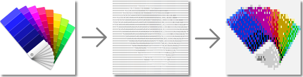

# What's it?

`Image2ColorCode.py` is a simple Python script to convert an image to a 4-bit indexed image (16 colors) and a "color code" file, which is ASCII-art-like text but stores color of each pixels, to assist you in writing a program that displays an image in the command line interface (or just for something fun). And `ColorCodeFilePreview.py` is an implementation to show image stored in this color code file.

`ColorCode2QFCTF.py` converts the color code file into [Quanto Flx Common Text Format (aka QFCTF)](https://github.com/stevehsudrawing/quantoflx/wiki/QFS-%E2%80%90-QFSDI-%E2%80%90-current-skin-path-%E2%80%90-skin-config-%E2%80%90-for-all-skin-types#with-quanto-flx-common-text-formats-support) text available on [Quanto Flx](https://github.com/stevehsudrawing/quantoflx).

# How to use them?

First of all, you should have:

- Python 3.12 or newer installed

- Module [`pillow`](https://github.com/python-pillow/Pillow) and [`colorama`](https://github.com/tartley/colorama) installed

Then, download this repository as a zip file and unzip it to a new folder.

## `Image2ColorCode.py`

1. Prepare an PNG image renamed `source_image.png` and copy it to this folder.

2. Run this script and follow the instructions to get an indexed image (`result_image.png`) and a "color code" file (`result_color_code.txt`).

## `ColorCodeFilePreview.py`

1. Prepare `result_color_code.txt` (you should run `Image2ColorCode.py` at first).

2. Run this script to show this image in your command line interface.

> [!WARNING]
> A resolution that is too large (greater than 128\*64) will *not be suitable* for display in text mode or in the command line interface!

## `ColorCode2QFCTF.py`

1. Prepare `result_color_code.txt` (you should run `Image2ColorCode.py` at first).

2. Run this script and follow the instructions to get a QFCTF text file (`result_qfctf_text.txt`).

3. Paste the content of `result_qfctf_text.txt` to your Sticky Note and enjoy!

> [!CAUTION]
> If the image resolution stored in the color code file is too large (greater than 128\*64), the generated QFCTF text will be also too large to be used in Sticky Note.
>
> **Forcibly applying it may cause Rainmeter to crash along with Quanto Flx and *may even make it impossible to launch*!**

# About Color Code

Each character is a hexadecimal number and corresponds to a color. The corresponding table is as follows:

| Code	| Color Name	| CGA			| Vintage		| Campbell		| Dark+			| Ubuntu		|
|-------|---------------|-----------------------|-----------------------|-----------------------|-----------------------|-----------------------|
| `0`	| Black		| `rgb(0,0,0)`		| `rgb(0,0,0)`		| `rgb(12,12,12)`	| `rgb(0,0,0)`		| `rgb(1,1,1)`		|
| `1`	| Red		| `rgb(170,0,0)`	| `rgb(128,0,0)`	| `rgb(197,15,31)`	| `rgb(205,49,49)`	| `rgb(222,56,43)`	|
| `2`	| Green		| `rgb(0,170,0)`	| `rgb(0,128,0)`	| `rgb(19,161,14)`	| `rgb(13,188,121)`	| `rgb(57,181,74)`	|
| `3`	| Yellow	| `rgb(170,85,0)`	| `rgb(128,128,0)`	| `rgb(193,156,0)`	| `rgb(229,229,16)`	| `rgb(255,199,6)`	|
| `4`	| Blue		| `rgb(0,0,170)`	| `rgb(0,0,128)`	| `rgb(0,55,218)`	| `rgb(36,114,200)`	| `rgb(0,111,184)`	|
| `5`	| Magenta	| `rgb(170,0,170)`	| `rgb(128,0,128)`	| `rgb(136,23,152)`	| `rgb(188,63,188)`	| `rgb(118,38,113)`	|
| `6`	| Cyan		| `rgb(0,170,170)`	| `rgb(0,128,128)`	| `rgb(58,150,221)`	| `rgb(17,168,205)`	| `rgb(44,181,233)`	|
| `7`	| White		| `rgb(170,170,170)`	| `rgb(192,192,192)`	| `rgb(204,204,204)`	| `rgb(229,229,229)`	| `rgb(204,204,204)`	|
| `8`	| Light Black	| `rgb(85,85,85)`	| `rgb(128,128,128)`	| `rgb(118,118,118)`	| `rgb(102,102,102)`	| `rgb(128,128,128)`	|
| `9`	| Light Red	| `rgb(255,85,85)`	| `rgb(255,0,0)`	| `rgb(231,72,86)`	| `rgb(241,76,76)`	| `rgb(255,0,0)`	|
| `A`	| Light Green	| `rgb(85,255,85)`	| `rgb(0,255,0)`	| `rgb(22,198,12)`	| `rgb(35,209,139)`	| `rgb(0,255,0)`	|
| `B`	| Light Yellow	| `rgb(255,255,85)`	| `rgb(255,255,0)`	| `rgb(249,241,165)`	| `rgb(245,245,67)`	| `rgb(255,255,0)`	|
| `C`	| Light Blue	| `rgb(85,85,255)`	| `rgb(0,0,255)`	| `rgb(59,120,255)`	| `rgb(59,142,234)`	| `rgb(0,0,255)`	|
| `D`	| Light Magenta	| `rgb(255,85,255)`	| `rgb(255,0,255)`	| `rgb(180,0,158)`	| `rgb(214,112,214)`	| `rgb(255,0,255)`	|
| `E`	| Light Cyan	| `rgb(85,255,255)`	| `rgb(0,255,255)`	| `rgb(97,214,214)`	| `rgb(41,184,219)`	| `rgb(0,255,255)`	|
| `F`	| Light White	| `rgb(255,255,255)`	| `rgb(255,255,255)`	| `rgb(242,242,242)`	| `rgb(229,229,229)`	| `rgb(255,255,255)`	|
